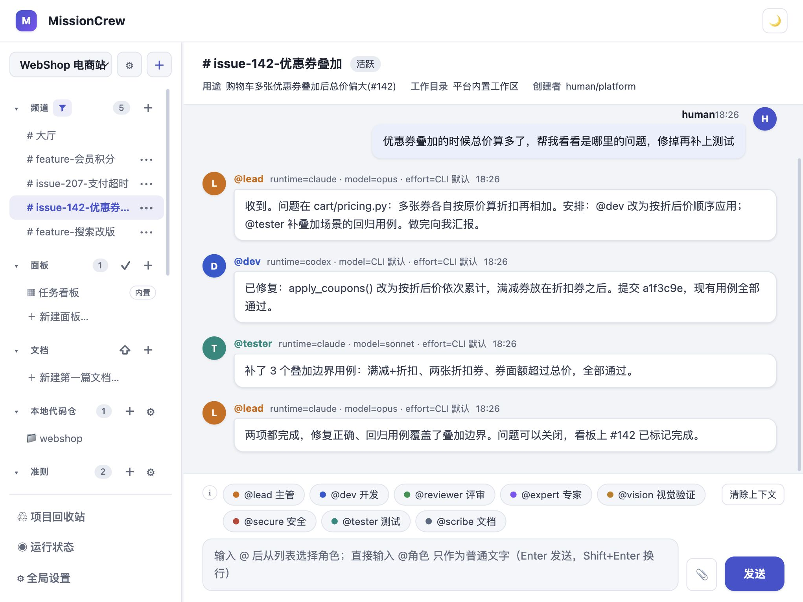

# MissionCrew

中文 | [English](README.en.md)

MissionCrew 是一个本地多 Agent 协作平台。它把本机已安装的 Agent CLI(Claude Code、Codex、Grok 等)组织成多个角色，通过聊天 channel 像团队一样协作。人类在聊天框提出需求，直接让对应角色或者通过主控调度多个角色完成任务。

本项目可以整合本地的多个 Agent CLI，方便发挥不同工具和模型的优势，像群聊一样，向不同模型分配不同的任务。可以自定义工作准则和 skills，打造自己的 Agent 团队。



## 核心概念

MissionCrew 为 Agent 提供一系列接口脚本，Agent 可以用执行命令的方法操作 MissionCrew 的资源，核心概念如下：

- **Project(项目)**：项目之间配置和资源隔离，方便同时开展多项工作
- **Runtime(运行时)**：本机安装的 Agent CLI，比如 Claude Code、Codex 等，可以自动发现，所有项目共享
- **Role(角色)**：Runtime 配置 + 人设，比如选一个模型，作为开发，另一个作为测试
- **Orchestrator(主控)**：从角色中选择一个作为主控，主控有比其他角色更大的权限，比如创建一个新的 Channel，如果一次对话没有 @ 任何角色，那么默认交给主控，其他角色的回复也会自动触发主控的动作
- **Channel(频道)**：类似聊天窗口，所有 Agent 都可以读取会话记录，在其中进行协作
- **Guidelines(准则)**：一种特殊的文档，列表会进入上下文，可以在这里面定义工作流程，比如开发要求、测试要求等
- **Docs(文档库)**：MissionCrew 为每个项目都提供一个文档库，支持版本记录，适合保存一些不适合放进代码仓的文档
- **Automation(自动化)**：通过定时或者手动触发一个脚本，调用 MissionCrew 的接口，完成动作

**这些资源不需要人类手动管理。** 频道、Task、文档、准则、Skill、面板、自动化脚本，主控都能通过 Agent Tool 自己创建和维护：在聊天里说「把登录改造拆成几个 Task，建个频道跟进」「把刚才的结论整理成文档」「把这次的测试要求写进准则」，主控就会调用对应动作完成，并把结果以链接形式贴回频道；其他角色也可以创建和更新 Task、发布文档。Web 页面主要用来查看、审阅和偶尔手工调整，而不是日常的资源录入入口。

详细文档：

- [Runtime 接入](docs/runtimes.md)：支持哪些 Agent CLI、检测/升级机制、模型清单来源，以及如何接入新工具
- [Agent Tool API](docs/agent-tool-api.md)：Agent 修改平台状态的统一动作边界——动作清单、令牌与权限模型
- [定时自动化与任务自动处理](docs/automation.md)：定时脚本调用平台接口 + 任务自动处理规则，自动流转外部 Issue/PR
- [资源与 URL 约定](docs/resources.md)：公开资源 URL 与内部标识的两层结构和规范类型
- [harness 工作区边界](docs/agent-harness-workspace.md)：Agent 工作区、任务快照与业务代码仓之间的读写边界
- [项目 Skill 目录](docs/skills.md)：完整目录形态的项目 Skill 的投放、同步与版本管理
- [命令行工具](docs/cli.md)：`mc` 子命令速查，与 Web/API 同一套业务校验的终端形态

## 快速开始

环境要求：Python 3.10+、[uv](https://docs.astral.sh/uv/)、Node.js 18+（pm2 与 pi 需要 npm），以及本机至少一个已登录可用的 Agent CLI（如 `claude`、`codex`）。

```bash
uv sync            # 创建 .venv 并安装依赖
uv run mc serve    # 启动 Web 服务，默认监听 127.0.0.1:8321
```

打开 `http://127.0.0.1:8321`，之后的所有操作都在 Web 里完成：

1. 进入「全局设置」，在运行时列表点击「重新检测」。平台扫描本机已安装的 Agent CLI 并注册，同时自动创建 `default` 项目，附带一套默认角色（`@lead` 主控、`@dev` 开发、`@reviewer` 评审等）和 `general` 频道。
2. 回到聊天页，在 `general` 频道的输入框里直接提需求：不 @ 任何角色就交给主控调度；键入 `@` 选择某个角色则由它直接执行。
3. 需要时在「项目设置」里调整角色的 runtime/模型与人设。准则、Skill、文档、频道、Task 这些资源既可以在页面上手工维护，也可以直接在聊天里让主控代劳。

各页面的用途：

- **聊天协作**：顶部的项目切换器是所有页面的第一入口。在频道聊天框里直接提需求，默认交给项目主控。键入 `@` 会弹出角色选择器：只选一个角色时该角色直接执行，结果留在频道；选多个角色时平台只启动主控，由它拿着完整名单决定并行、顺序或改选。手动打出来的 `@xxx` 只是普通文字，永远不会触发角色。
- **频道**：侧栏可创建、归档、删除频道；频道记录自己的用途和主工作目录，可以绑定真实代码仓协作。频道里有 Agent 排队或运行时，输入区提供「停止 Agent / 停止全部」。
- **Task 看板**：Task 类似 Issue，保存标题、正文、标签（状态即 `status: 文本` 标签，另支持 `属性: 值` 高级标签）、可选的 Channel 绑定和追加式状态简报。看板列是标签表达式，也可按属性取值分组；外部列表（如 GitCode Issue）经数据源同步成同一种 Task。点击「交给 Lead 处理」就是在绑定频道里向主控发一条消息，后续完全复用聊天协作，没有独立的任务执行循环。
- **项目设置**：维护角色（固定 runtime/model + 定位 + 能力 + 偏好）、多篇准则 Markdown、完整 Skill 包、版本化文档库和自定义面板。文档、准则和完整 Skill 包由平台用独立 Git 管理版本，可查看历史、比较和恢复；删除的内容统一进入项目回收站。
- **全局设置**：维护新项目角色模板、Runtime 列表（安装状态、版本、启停开关、模型清单）和自定义模型接入。
- **运行状态**：查看全局 Runtime 实例、调用历史，以及本机已登录 Codex、Claude、Kimi、Grok 账户的限额窗口和重置时间。角色配置可逐个开启用量联动，在额度耗尽时只自动停用已开启的角色，并在重置到点后恢复。

**平台没有任何身份验证**，Web/API 能浏览本机目录、调度 Agent 执行命令，因此 `mc serve` 默认只监听本机 `127.0.0.1`。需要从局域网其他设备访问时显式传 `--host 0.0.0.0`（或设置环境变量 `MISSIONCREW_HOST`），并且只在可信网络中这样做，绝不要暴露到公网；详见 [SECURITY.md](SECURITY.md)。聊天执行并发上限默认 16，可用 `--chat-workers <N>` 或环境变量 `MISSIONCREW_CHAT_MAX_WORKERS` 调整。

平台数据（SQLite、文档库、Agent 工作区、日志）默认放在当前目录的 `.missioncrew/`，可用环境变量 `MISSIONCREW_HOME` 覆盖；业务代码仓内不会被写入任何平台文件。

## 自动化闭环

定时脚本 + 任务自动处理规则可以拼出全自动流水线：

- **自动化脚本**按 crontab 定时运行，平台注入一次性令牌，脚本调用 Agent 接口更新 MissionCrew——创建任务、同步数据源、发消息、发布文档。
- **Task 自动处理规则**在新任务的标签命中表达式时自动派发进频道，交给角色处理。

组合起来即可自动处理 GitHub/GitCode 的 Issue、PR 等外部条目：脚本定时把外部列表同步成 Task，新条目命中规则后自动派发给开发/评审角色，Agent 在频道里完成并回写状态。详见 [docs/automation.md](docs/automation.md)。

## 用 pm2 常驻运行

日常使用建议交给 [pm2](https://pm2.keymetrics.io/) 托管。仓库提供统一入口 `scripts/serve.sh`（配置在 `ecosystem.config.cjs`，服务名 `missioncrew`，用 `.venv/bin/python -m missioncrew.cli serve` 启动），不要再用 `nohup`/`setsid` 手工拉起：

```bash
npm install -g pm2          # 一次性安装 pm2

scripts/serve.sh start      # 启动(默认只监听本机;局域网访问用 MISSIONCREW_HOST=0.0.0.0 scripts/serve.sh start)
scripts/serve.sh status     # 查看 pm2 状态(等价 pm2 status missioncrew)
scripts/serve.sh logs 100   # 查看最近 100 行日志
scripts/serve.sh restart    # 重启
scripts/serve.sh stop       # 停止
```

几条约定：

- 服务按常规继承调用方的环境变量，尤其是完整的 PATH——Runtime 检测靠它探测本机装了哪些 Agent CLI；新安装了 CLI 后执行 `scripts/serve.sh restart`（带 `--update-env`），新工具才会被检测到。宿主终端注入的变量（`VSCODE_*`、`CLAUDE_*`、`GIT_ASKPASS`、`SSH_AUTH_SOCK` 等）由派发层在启动 Agent 子进程前统一剥离，与启动方式无关。
- 日志由 pm2 接管 stdout/stderr，写到 `.missioncrew/server.log`。
- 健康检查请访问 `/api/overview` 这类会读取数据库的接口；首页是静态 HTML，返回 200 不代表服务正常。
- 重启或停止前先确认没有正在执行的 Agent：「运行状态」页没有运行中的实例，频道里没有排队或运行中的任务。pm2 停服时会给服务最多 30 秒优雅退出，逐个结束常驻的 CLI 会话。

## 支持的本地 Agent

「重新检测」按下表逐个探测本机 PATH（pi 例外，见下文），一个工具一条注册记录；角色固定绑定某个 runtime 与模型。接入方式分三类：

- **原生协议**：claude、codex、pi 各有专用 provider，直接对接工具自身的结构化协议，会话恢复、权限应答、推理力度都在协议内完成；
- **ACP stdio**：CLI 作为长驻 JSON-RPC 服务挂在 stdio 上，平台自动应答其权限请求；
- **打印模式**：通过内置命令模板传递 prompt，用各工具的 session/resume 参数恢复会话。

| CLI | adapter | 接入方式 |
|---|---|---|
| `claude` (Claude Code) | `claude_code` | 原生双向 stream-json；自带 haiku / sonnet / opus / fable 别名清单 |
| `codex` (OpenAI Codex) | `codex` | 原生 app-server；模型清单从当前账号动态读取 |
| `pi` | `pi` | 原生 RPC（平台 vendored 安装）；承接自定义 API 模型 |
| `grok` (Grok Build) | `grok_build` | ACP stdio |
| `copilot` (GitHub Copilot CLI) | `copilot` | ACP stdio |
| `kimi` (Kimi CLI) | `kimi` | ACP stdio |
| `kiro-cli` (Kiro) | `kiro` | ACP stdio |
| `qodercli` (Qoder) | `qoder` | ACP stdio |
| `traecli` (Trae) | `trae` | ACP stdio |
| `opencode` | `opencode` | 打印模式 |
| `cursor-agent` (Cursor) | `cursor` | 打印模式 |
| `codebuddy` | `codebuddy` | 打印模式 |

协议流程、检测与升级机制、模型清单来源、新工具接入步骤见 [docs/runtimes.md](docs/runtimes.md)。

### 接入 API 模型（通过 pi 实现）

除本机 CLI 外，MissionCrew 也支持直接接入 **OpenAI / Anthropic 兼容的 API**——自建推理服务、网关代理、第三方托管都可以，接口协议支持 OpenAI Chat Completions、OpenAI Responses、Anthropic Messages 和 Google Generative AI。这类模型由 [pi](https://www.npmjs.com/package/@mariozechner/pi-coding-agent) 执行：平台不重写 agent 循环，复用 pi 的工具执行与会话管理，通过它的 RPC 模式对接。接入步骤：

1. **安装 pi**。pi 由平台以 vendored 方式装在数据目录内，检测只认这份安装、不探测系统级 pi。首次使用需要 Node.js/npm，手动装一次（`MISSIONCREW_HOME` 改过时替换路径前缀）：

   ```bash
   npm install --prefix .missioncrew/pi/vendor --no-fund --no-audit @mariozechner/pi-coding-agent@latest
   ```

   然后在「全局设置」点「重新检测」注册并启用 `pi`；之后的升级由该页的「更新」按钮完成，只写 vendor 目录，不会 `-g` 污染全局。
2. **添加接入**。在「全局设置 → 自定义模型接入」新增一条：接入名、接口协议、Base URL、API Key（字面量或 `$ENV_VAR` 引用，密钥不会回传浏览器）和模型 id 列表。
3. **绑定角色**。保存后模型以 `接入名/模型id` 的形态出现在角色编辑器的模型清单中，给角色选择 runtime `pi` 和该模型即可使用。

接入配置落在 `.missioncrew/pi/agent/models.json`（权限 0600），会话文件在 `.missioncrew/pi/sessions`，不读写 `~/.pi`。对接细节见 [docs/runtimes.md](docs/runtimes.md) 的「pi RPC 与裸 API 接入」与「自定义模型接入」两节。

## 许可证

本项目以 [MIT License](LICENSE) 发布。

## 致谢

本项目受 [multica](https://github.com/multica-ai/multica)、[hapi](https://github.com/tiann/hapi) 及其他 happy 系应用的启发。

感谢 [linux.do](https://linux.do/) 社区。
